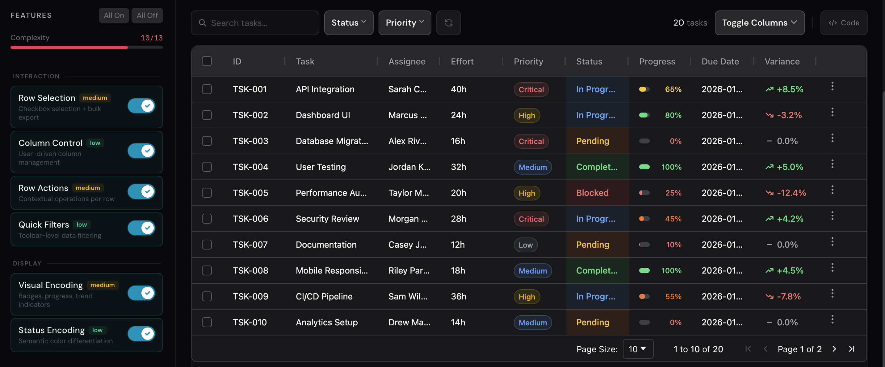
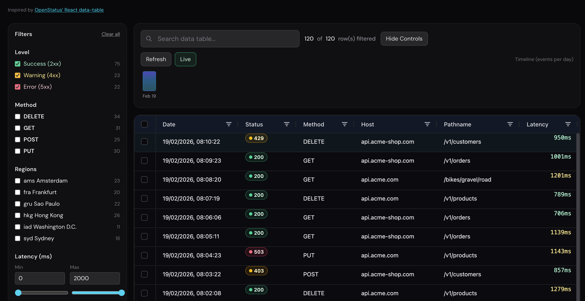

# AG-Grid Production Patterns

**[Live demo →](https://datatable-patterns-with-ag-grid.vercel.app/)**

Production-style data table reference implementations built with Angular + AG Grid Community.

A hands-on visual reference for AG-Grid features — composed in a modern Angular codebase, with no Enterprise license required.

Built to have a place to visualize and explore how AG-Grid features look and behave together.

## What's inside

### Feature Explorer

A controlled environment for isolating AG-Grid behaviors—column visibility, row actions, filters, renderers, and grouping—to understand how individual features affect table density, usability, and complexity. Toggle features on/off to evaluate UX trade-offs in isolation.



**Features demonstrated:**

- Column visibility management with progressive disclosure
- Row actions and context menus
- Custom cell renderers (badges, progress bars, trends)
- Grouped column headers with visibility controls
- Floating filters
- Row selection and details panels

### Observability Table

A production-style observability table inspired by [OpenStatus](https://data-table.openstatus.dev/), designed to surface status, latency, and trends without overwhelming operators. Focuses on dense data scanning, conditional highlighting, and drill-down workflows.



**Features demonstrated:**

- External filter panels with status/method/endpoint filtering
- Custom cell renderers for status, latency, and timing phases
- Server-driven data with debounced search
- Loading states and latency-aware pagination
- High-signal UI optimized for operational monitoring

## Design principles

- **Intent-first patterns**: Each scenario has a user workflow, not a checklist of widgets.
- **Constraint-aware UX**: Loading states, debounce, progressive disclosure, scanability.
- **Maintainable composition**: Reusable components for menus/filters/renderers where it makes sense.
- **AG-Grid Community only**: All patterns use AG-Grid Community (no Enterprise features) to keep implementations broadly applicable.

## Tech Stack

- **Angular 21** with Signals
- **AG-Grid Community 35** (no Enterprise features)
- **Angular CDK** for menus and overlays
- **Tailwind CSS 4** for styling
- **RxJS** for reactive data flows

## Run locally

```bash
npm install
npm start
```

Then open `http://localhost:4200/`.

## Build

```bash
npm run build
```

## Project Status

Actively developed. Feedback and contributions welcome — open an issue or reach out.
